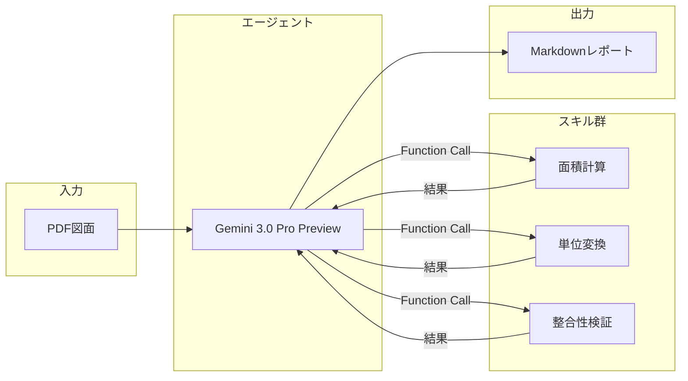

# Plan2Table

> 📐 **建築図面を「読む」から「使えるデータ」に変えるAIエージェント（Domain-Specific Agent）**

建築図面（PDF）から部屋情報を自動抽出し、美しいMarkdownレポートを生成するWebアプリケーションです。  
Google Cloud Vertex AI（Gemini 3.0 Pro Preview）と **Function Calling**[^1] を活用した「エージェント方式」により、高精度な数値抽出と検証を実現しています。  
**図面タイプ自動判断機能**により、寸法線がある詳細図面と面積が記載されている簡易図面の両方に対応しています。

## 特徴

- **ドラッグ&ドロップでPDFをアップロード**: 平面詳細図や仕上表を含む図面に対応
- **図面タイプ自動判断**: 寸法線がある詳細図面（`detailed`）と面積が記載されている簡易図面（`simple`）を自動判別し、適切な処理を実行
- **AIによる自動抽出**: 室名、帖数、面積、床・壁・天井仕上げ、備考などを一括抽出
- **エージェントスキルによる検証**: AIが自律的にツールを呼び出し、計算・単位変換・整合性チェックを実行
- **柔軟な検証ロジック**: 固定の必須部屋リストに依存せず、図面から読み取れる情報に基づいて柔軟に検証
- **Markdownレポート出力**: プロフェッショナルな外観のレポートを即座に生成

## アーキテクチャ

本アプリケーションは、従来の「一発でAIに回答を求める」方式ではなく、**AIが自律的にツールを呼び出して検証・計算する「エージェント方式」** を採用しています。

以下は、Plan2Table における「論理的な処理フロー」を示した図です。
基盤モデル（エージェント）とスキル群の役割分担に焦点を当てています。



> ℹ️ **実行環境について**  
> 図中の「エージェント（Gemini）」は Google Cloud Vertex AI 上で実行されており、「スキル群（面積計算・単位変換・整合性検証）」は、本アプリケーションとしてデプロイされた **Python関数** が実行主体です。エージェントはスキルを直接実行することはなく、**必要な処理を判断し、呼び出しを指示する役割**を担っています。

## ワークフロー


1. **Ingest: データの入力と送信**
   図面PDFをバイナリ形式のまま、**Gemini 3.0 Pro Preview** へダイレクトにストリーム。プロンプトと共にコンテキストを保持した状態で処理を開始します。

2. **Analyze: マルチモーダル図面解析とタイプ判断**
   LLMによる視覚的解析を実行。図面内の線画・記号・レイアウトを直接読み取り、室名や面積などの情報を**空間的に認識**して抽出します。  
   同時に、図面タイプ（`detailed`/`simple`）を自動判断し、適切な処理方法を選択します。

3. **Validate: スキルの自律実行 (Function Calling)**
   抽出された数値を**Python関数**へ渡し、計算整合性や単位変換を自律的に検証。AIの判断とプログラムの正確性を組み合わせて精度を担保します。  
   **`detailed`図面の場合**: 寸法線を読み取って面積を計算。**`simple`図面の場合**: 記載されている面積をそのまま抽出。

4. **Export: 構造化レポートの生成**
   検証をパスしたクリーンなデータに基づき、再利用性の高い**Markdown形式**のレポートを動的に生成します。

5. **Render: HTMLレンダリングと表示**
   生成されたMarkdownを即座に**HTMLへパース**。ユーザーインターフェース上で、リッチなプレビューとしてシームレスに表示します。

---

> [!NOTE]
> 開発・デバッグ用途として、`pdfplumber` を用いたテキスト解析（正規表現）も並行して実施しています。抽出結果はブラウザの開発者コンソールに出力され、AIの出力と比較確認できます。


## 利用可能なスキル

AIエージェントは以下のスキルを自律的に呼び出すことができます：

| スキル名 | 説明 | 入力例 | 出力例 |
|---------|------|--------|--------|
| `calculate_area` | 幅×高さから面積を計算 | `width=3.9, height=5.1` | `19.89` |
| `convert_tsubo_to_m2` | 坪からm²へ変換 | `tsubo=12.58` | `41.59` |
| `calculate_tatami_area_m2` | 帖数からm²へ変換 | `tatami=6.0` | `9.92` |
| `validate_area_sum` | 合計面積の整合性を検証 | `room_areas=[19.89, 11.48], expected_total=31.37` | `{diff: 0.0, is_valid: true}` |
| `calculate_room_area_from_dimensions` | 寸法（mm）から部屋の面積と帖数を計算 | `room_name="玄関", width_mm=1200, depth_mm=1400` | `{area_m2: 1.68, tatami: 1.0, calculation: "1.2m × 1.4m = 1.68㎡"}` |
| `calculate_composite_area` | 複数の矩形領域を加算・減算して面積を計算 | `room_name="LDK", areas=[{width_mm: 3900, depth_mm: 5100, operation: "add"}]` | `{area_m2: 19.89, tatami: 12.3, steps: [...]}` |

これにより、AIの「頭の中の計算」ではなく、実際のPython関数による正確な計算・検証が行われます。その結果、**基盤モデルの推論誤差を許容せず、数値だけは必ず機械的に正しくする**という設計を実現しています。

### 図面タイプ自動判断

本アプリケーションは、入力された図面を以下の2タイプに自動分類し、適切な処理を行います：

- **`detailed`（詳細図面）**: 寸法線（mm単位）があり、面積を計算できる図面
  - 平面詳細図、施工図など
  - 寸法線を読み取って`calculate_room_area_from_dimensions`で面積を計算
  - 仕上表に記載されている全ての室について、必ず面積を算出
  
- **`simple`（簡易図面）**: 面積が文字で直接記載されており、寸法線がない図面
  - 間取り図、パンフレットなど
  - 記載されている面積をそのまま抽出
  - 記載がない場合は空欄でも可

この判断により、様々なタイプの図面に柔軟に対応できます。

## ファイル構成

```
plan2table/
├── main.py                     # FastAPIアプリケーション本体
├── extractors/
│   ├── __init__.py
│   ├── area_regex.py           # 正規表現による面積抽出（デバッグ用）
│   ├── text_extractor.py       # PDFからのテキスト抽出
│   ├── skills.py               # スキル関数の実装
│   └── tool_definitions.py     # Function Calling用のツール定義
├── prompts/
│   ├── __init__.py             # プロンプト読み込みユーティリティ
│   └── area_extract.md         # AIへのプロンプト
├── templates/
│   └── index.html              # フロントエンドUI
├── tests/
│   ├── test_area_regex.py      # 正規表現抽出のテスト
│   └── test_prompt_load.py     # プロンプト読み込みのテスト
├── .github/
│   └── workflows/
│       └── sync-to-hf-spaces.yml  # Hugging Face Spaces自動同期
├── Dockerfile
├── Makefile
├── requirements.txt
└── README.md
```


## 技術スタック

- **Backend**: FastAPI + Uvicorn
- **AI**: Google Cloud Vertex AI (Gemini 3.0 Pro Preview)
- **SDK**: google-genai
- **PDF処理**: pdfplumber
- **Frontend**: HTML + Tailwind CSS + htmx
- **Infrastructure**: Docker

## 入力例１（建築図面PDF）

以下は、本アプリに入力した建築図面PDFの一部です。

[](https://gyazo.com/8d510836fe35d70b2066b9478e16977a)

## 出力例１

<details>
<summary><strong>📄 アプリ出力例：建築図面解析レポート（Aタイプ平面詳細図）</strong></summary>

<br>

> ℹ️ **このセクションはアプリの自動生成出力例です**  
> PDFの建築図面を入力として、図面情報・面積計算・内装仕上表を構造化して出力しています。

---

# 建築図面解析レポート：Aタイプ平面詳細図

# 図面概要

- **図面名称**：Aタイプ平面詳細図  
- **図面番号**：DA-01  
- **ファイル名**：File Name  
- **縮尺**：図示（寸法線より推定）

---

## 面積情報

| 項目 | 面積 (㎡) | 坪換算 (坪) | 計算式・備考 |
|---|---:|---:|---|
| 住戸専用面積 | 41.71㎡ | 12.62坪 | 3.90 × 5.10 = 19.89<br>4.85 × 4.50 = 21.82<br>**合計：41.71㎡** |
| バルコニー面積 | 6.30㎡ | 1.91坪 | 1.40 × 4.50 = 6.30㎡ |
| 部屋面積合計 | 21.04㎡ | 12.95帖 | 図面記載の計算値（19.89 + 1.15） |

---

## 各室の仕上・詳細

### 居室・主要部分

| 室名 | 帖数 (帖) | 面積 (㎡) | 床 | 巾木 | 壁 | 天井 | 備考 |
|---|---:|---:|---|---|---|---|---|
| リビングダイニング | 7.0帖 | 11.48㎡ | フローリング W=101 | 木製 | ビニールクロス | ビニールクロス | カーテンボックス、カーテンレール(W)、エアコン（壁掛け） |
| キッチン | 約2.2帖 | 3.60㎡（推定） | 塩ビ複合床材 ※1 | 木製 | ビニールクロス（流し前：キッチンパネル） | ビニールクロス | キッチン1800、ミニキッチン（仕上表記載）※2 |
| 洋室 | 5.7帖 | 9.55㎡ | フローリング W=101 | 木製 | ビニールクロス | ビニールクロス | カーテンボックス、カーテンレール(W) |
| ウォークインクローゼット | 約1.0帖 | 1.68㎡（推定） | フローリング W=101 | 木製 | ビニールクロス | ビニールクロス | ハンガーパイプ 30φ |

---

### 水回り・その他

| 室名 | 面積 (㎡) | 床 | 巾木 | 壁 | 天井 | 備考 |
|---|---:|---|---|---|---|---|
| 玄関 | 1.44㎡（推定） | 石製（規格品） | 石製 | ビニールクロス | ビニールクロス | 上框：石製、下足入れ |
| 廊下 | - | フローリング W=101 | 木製 | ビニールクロス | ビニールクロス | - |
| 洗面室 | 2.34㎡（推定） | 塩ビ複合床材 | ソフト巾木 | ビニールクロス | ビニールクロス | 洗面化粧台、物入、洗濯機パン（640×640） |
| 浴室 | 1.92㎡（規格） | - | - | - | - | ユニットバス 1216サイズ |
| トイレ | 1.03㎡（推定） | 塩ビ複合床材 | ソフト巾木 | ビニールクロス | ビニールクロス | シャワートイレ、ペーパーホルダー、タオル掛、吊戸棚 |

---

※1：仕上表には「LDまたは廊下と一体タイプはフローリング」との注記あり。  
※2：仕上表には「ミニキッチン」とあるが、平面図には「キッチン1800」が描かれており、**平面図が優先**されると考えられます。

---

## 特記事項

- **遮音対策**  
  遮音間仕切壁（PB12.5 + 遮音シート + グラスウール充填）を採用。

- **断熱対策**  
  天井スラブ断熱ボード折返し部分範囲（壁・梁より D=450）、  
  壁打込み断熱ボード（厚10）の施工指示あり。

- **設備**  
  換気口 100φ、給気口 150φ、エアコンスリーブ 75φ 等の位置指定あり。

- **寸法について**  
  面積計算は図面の寸法線（壁芯）および記載数値を基に算出。

</details>


## 入力例２（建築図面PDF）

以下は、本アプリに入力した建築図面PDFの一部です。

[](https://gyazo.com/4f51ab2992cc6df86bf722803f8b7af8)

## 出力例２
<details>
<summary><strong>間取り図サンプル A-1（クリックで展開）</strong></summary>

<br>

> ℹ️ **このセクションはアプリの自動生成出力例です**  
> PDFの建築図面を入力として、図面情報・面積計算・内装仕上表を構造化して出力しています。

---
# 図面の概要

- **図面名称**：間取り図サンプル A-1  
- **図面タイプ**：間取り図（寸法線なし）  
- **階数**：2階建て（1F / 2F）  
- **方位**：上が北（N）

---

## 面積情報

図面に **延床面積・専用面積の数値記載はありません**。  
各居室の帖数から換算した概算面積は以下の通りです。

| 階 | 室名 | 帖数 | 概算面積 (㎡) |
|---|---|---:|---:|
| 1F | 洋室 | 7.2帖 | 約11.66㎡ |
| 2F | 洋室 | 6.7帖 | 約10.85㎡ |
| 2F | LDK | 14.5帖 | 約23.49㎡ |

※ **1帖 = 1.62㎡** として換算

---

## 各室の仕上・詳細

| 階 | 室名 | 帖数 | 概算面積 (㎡) | 備考 |
|---|---|---:|---:|---|
| 1F | 洋室 | 7.2帖 | 11.66 | クローゼット（CL）あり |
| 1F | 玄関 | - | - | 下足入、収納あり |
| 1F | 洗面室 | - | - | 洗濯機パン、洗面化粧台 |
| 1F | 浴室 | - | - | ユニットバス |
| 2F | LDK | 14.5帖 | 23.49 | カウンターキッチン、物入あり |
| 2F | 洋室 | 6.7帖 | 10.85 | クローゼット（CL）×2 |
| 2F | トイレ | - | - | - |
| 2F | バルコニー | - | - | 南側配置 |

※ 仕上表がないため、**床・壁・天井の仕様は記載なし**

---

## まとめ・注釈

- **間取り**：2LDK  

### 特徴
- 1階に主寝室となる洋室と水回りを配置  
- 2階にLDKと別の洋室を配置した構成  
- 階段下に収納スペースあり  
- 各居室にクローゼットを設け、収納が充実  
- 駐車場スペースが図示されている

  
</details>

<br>

## セットアップ

### 環境変数

以下の環境変数を設定してください：

| 変数名 | 必須 | 説明 |
|--------|------|------|
| `GOOGLE_CLOUD_PROJECT` | ✅ | Google CloudプロジェクトID |
| `VERTEX_SERVICE_ACCOUNT_KEY` | ✅ | Vertex AI用サービスアカウントJSONキーの**内容全体** |
| `VISION_SERVICE_ACCOUNT_KEY` | ✅ | Raster OCR（Vision API）用サービスアカウントJSONキーの**内容全体** |
| `GCP_SERVICE_ACCOUNT_KEY` | - | 旧互換用（未設定時は`VERTEX_SERVICE_ACCOUNT_KEY`を利用） |
| `VERTEX_LOCATION` | - | Vertex AIのロケーション（デフォルト: `global`） |
| `VERTEX_MODEL_NAME` | - | 使用するモデル名（デフォルト: `gemini-3-pro-preview`） |

### ローカル開発（Docker + 1Password）

本プロジェクトでは、1Password CLIを使って認証情報を安全に管理しています：

```bash
# 1Password CLIでシークレットが取得できることを確認
make check

# Dockerイメージをビルドして起動
make run

# ロケーションやモデルを変更する場合
make run VERTEX_LOCATION=us-central1 VERTEX_MODEL_NAME=gemini-3-flash-preview
```

ブラウザで http://localhost:7860 にアクセスしてください。

### 画面とエンドポイント

- `GET /` : 統合ページ（Raster/Vector抽出）
- `POST /raster/upload` : Raster PDF抽出、`raster.csv` を生成
- `POST /vector/upload` : Vector PDF抽出（4列CSVのみ）、`vector.csv` を生成
- `GET /jobs/{job_id}/raster.csv` : Raster結果CSVをダウンロード
- `GET /jobs/{job_id}/vector.csv` : Vector結果CSVをダウンロード
- `GET /area` : 既存LLM解析ページ
- `POST /area/upload` : 既存LLM解析API
- `POST /upload` : 互換エンドポイント（`/area/upload`へ委譲）

抽出ジョブはUUID v4で管理され、成果物は `/tmp/plan2table/jobs/<job_id>/` に保存されます（`metadata.json` を含む）。

### Hugging Face Spacesへのデプロイ

1. SpaceのSettingsで`GOOGLE_CLOUD_PROJECT`、`VERTEX_SERVICE_ACCOUNT_KEY`、`VISION_SERVICE_ACCOUNT_KEY`を設定
2. Dockerfileが自動的にビルド・デプロイされます

> [!TIP]
> 本リポジトリには GitHub Actions（`.github/workflows/sync-to-hf-spaces.yml`）が設定されており、`main`ブランチへのプッシュ時に Hugging Face Spaces へ自動同期されます。


[^1]: ここでいう Function Calling は、視覚・言語・構造理解を統合した基盤モデル（Foundation Model）が、推論の一部をアプリケーション側の関数に委譲するための仕組みです。Plan2Table では、基盤モデルに判断を任せつつ、数値計算や検証といった決定的処理はコード側で実行することで、**再現性と信頼性を優先したシステム設計**を採用しています。


