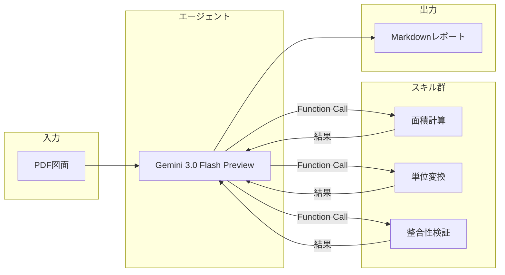

# Plan2Table

建築図面（PDF）から部屋情報を自動抽出し、美しいMarkdownレポートを生成するWebアプリケーションです。Google Cloud Vertex AI（Gemini 3.0 Flash Preview）と **Function Calling** を活用した「エージェント方式」により、高精度な数値抽出と検証を実現しています。

## 特徴

- **ドラッグ&ドロップでPDFをアップロード**: 平面詳細図や仕上表を含む図面に対応
- **AIによる自動抽出**: 室名、帖数、面積、床・壁・天井仕上げ、備考などを一括抽出
- **エージェントスキルによる検証**: AIが自律的にツールを呼び出し、計算・単位変換・整合性チェックを実行
- **Markdownレポート出力**: プロフェッショナルな外観のレポートを即座に生成

## アーキテクチャ

本アプリケーションは、従来の「一発でAIに回答を求める」方式ではなく、**AIが自律的にツールを呼び出して検証・計算する「エージェント方式」** を採用しています。



### 処理の流れ

1. **PDF読み込み**: ユーザーがアップロードした図面PDFをバイナリとして取得
2. **テキスト抽出**: pdfplumberで補助的にテキストを抽出（正規表現によるフォールバック用）
3. **AIへ送信**: PDFバイナリとプロンプトをGemini 3.0 Flash Previewに送信
4. **Function Calling**: AIが必要に応じてスキル（計算・変換・検証）を呼び出し
5. **スキル実行**: Python関数で正確な計算を実行し、結果をAIに返却
6. **レポート生成**: AIが検証済みの数値を使ってMarkdownレポートを生成
7. **HTML変換**: MarkdownをHTMLに変換し、スタイル付きで表示

## 利用可能なスキル

AIエージェントは以下のスキルを自律的に呼び出すことができます：

| スキル名 | 説明 | 入力例 | 出力例 |
|---------|------|--------|--------|
| `calculate_area` | 幅×高さから面積を計算 | `width=3.9, height=5.1` | `19.89` |
| `convert_tsubo_to_m2` | 坪からm²へ変換 | `tsubo=12.58` | `41.59` |
| `calculate_tatami_area_m2` | 帖数からm²へ変換 | `tatami=6.0` | `9.92` |
| `validate_area_sum` | 合計面積の整合性を検証 | `room_areas=[19.89, 11.48], expected_total=31.37` | `{diff: 0.0, is_valid: true}` |

これにより、AIの「頭の中の計算」ではなく、実際のPython関数による正確な計算・検証が行われます。

## ファイル構成

```
plan2table/
├── main.py                     # FastAPIアプリケーション本体
├── extractors/
│   ├── __init__.py
│   ├── area_regex.py           # 正規表現による面積抽出（フォールバック）
│   ├── text_extractor.py       # PDFからのテキスト抽出
│   ├── skills.py               # スキル関数の実装
│   └── tool_definitions.py     # Function Calling用のツール定義
├── prompts/
│   └── area_extract.md         # AIへのプロンプト
├── templates/
│   └── index.html              # フロントエンドUI
├── Dockerfile
├── Makefile
├── requirements.txt
└── README.md
```

## セットアップ

### 環境変数

以下の環境変数を設定してください：

| 変数名 | 必須 | 説明 |
|--------|------|------|
| `GOOGLE_CLOUD_PROJECT` | ✅ | Google CloudプロジェクトID |
| `GCP_SERVICE_ACCOUNT_KEY` | ✅ | サービスアカウントJSONキーの**内容全体** |
| `VERTEX_LOCATION` | - | Vertex AIのロケーション（デフォルト: `global`） |
| `VERTEX_MODEL_NAME` | - | 使用するモデル名（デフォルト: `gemini-3-flash-preview`） |

### ローカル開発（Docker + 1Password）

本プロジェクトでは、1Password CLIを使って認証情報を安全に管理しています：

```bash
# 1Password CLIでシークレットが取得できることを確認
make check

# Dockerイメージをビルドして起動
make run

# ロケーションやモデルを変更する場合
make run VERTEX_LOCATION=us-central1 VERTEX_MODEL_NAME=gemini-2.0-flash
```

ブラウザで http://localhost:7860 にアクセスしてください。

### Hugging Face Spacesへのデプロイ

1. SpaceのSettingsで`GOOGLE_CLOUD_PROJECT`と`GCP_SERVICE_ACCOUNT_KEY`を設定
2. Dockerfileが自動的にビルド・デプロイされます

## 技術スタック

- **Backend**: FastAPI + Uvicorn
- **AI**: Google Cloud Vertex AI (Gemini 3.0 Flash Preview)
- **SDK**: google-genai (新SDK)
- **PDF処理**: pdfplumber
- **Frontend**: HTML + Tailwind CSS + htmx
- **Infrastructure**: Docker

## 入力例（建築図面PDF）

以下は、本アプリに入力した建築図面PDFの一部です。

[](https://gyazo.com/8d510836fe35d70b2066b9478e16977a)

## 出力例

<details>
<summary><strong>📄 アプリ出力例：建築図面解析レポート（Aタイプ平面詳細図）</strong></summary>

<br>

> ℹ️ **このセクションはアプリの自動生成出力例です**  
> PDFの建築図面を入力として、図面情報・面積計算・内装仕上表を構造化して出力しています。

---

# 建築図面解析レポート：Aタイプ平面詳細図

## 1. 図面の概要

本図面は「Aタイプ」の住戸に関する**平面詳細図**であり、各室のレイアウト、寸法、および内装仕上情報が網羅されています。

- **図面名称**：平面詳細図  
- **図面番号**：DA-01  
- **住戸タイプ**：Aタイプ  
- **主要構成**：  
  LDK、洋室、キッチン、洗面室、便所、浴室、ウォークインクローゼット（WIC）、バルコニー  

---

## 2. 面積情報

図面に記載された計算式に基づき、以下の面積が算出されています。

### 住戸専用面積

**計算式**

- 3.90m × 5.10m = 19.89㎡  
- 4.85m × 4.50m = 21.82㎡  

**合計**：  
**41.71㎡（約12.58坪）**

---

### バルコニー面積

**計算式**

- 1.40m × 4.50m = 6.30㎡  

**合計**：  
**6.30㎡（約1.9坪）**

---

### 部屋面積（主要居室合計）

**計算式**

- 19.89㎡ + 1.15㎡ = 21.04㎡  

**合計**：  
**21.04㎡（約12.95帖）**

---

## 3. 各室の仕上・詳細

| 室名 | 面積 / 帖数 | 床 | 巾木 | 壁 | 天井 | 備考 |
|---|---|---|---|---|---|---|
| LDK | 11.48㎡（7.0帖） | フローリング W=101 | 木製（オレフィン） | ビニールクロス | ビニールクロス | カーテンボックス、カーテンレール（W）、エアコン（壁掛け） |
| 洋室 | 9.55㎡（5.7帖） | フローリング W=101 | 木製（オレフィン） | ビニールクロス | ビニールクロス | カーテンボックス、カーテンレール（W） |
| 玄関 | - | 石貼り（規格品） | 石製 | ビニールクロス | ビニールクロス | 上框：石製、下足入れ |
| 廊下 | - | フローリング W=101 | 木製（オレフィン） | ビニールクロス | ビニールクロス | - |
| キッチン | - | 塩ビ複合床材* | 木製（オレフィン） | ビニールクロス / タイル・パネル貼 | ビニールクロス | ミニキッチン（*LD一体時はフローリング） |
| 洗面室 | - | 塩ビ複合床材 | ソフト巾木 | ビニールクロス | ビニールクロス | 洗面化粧台、物入、洗濯機パン（640×640） |
| 便所 | - | 塩ビ複合床材 | ソフト巾木 | ビニールクロス | ビニールクロス | シャワートイレ、ペーパーホルダー、タオル掛、吊戸棚 |
| WIC | - | フローリング W=101 | 木製（オレフィン） | ビニールクロス | ビニールクロス | ウォークインクローゼット |
| 浴室 | 1216サイズ | - | - | - | - | - |

---

## 4. まとめ・注釈

- **遮音性能**  
  隣戸との間仕切壁には、  
  **PB（12.5mm）＋遮音シート＋グラスウール充填**  
  の遮音間仕切が採用されています。

- **断熱性能**  
  天井スラブおよび壁面には、**奥行450mmの範囲**で  
  **断熱ボード（ア10）の折り返し施工**が指定されています。

- **設備**  
  LDKおよび洋室には、**エアコン実装またはスリーブ**が設置されており、  
  機能的な居住空間が確保されています。

- **バリアフリー配慮**  
  出入り可能窓の立ち上がり寸法（**FL+90、FL+505**）など、  
  開口部の詳細も明記されています。

</details>
