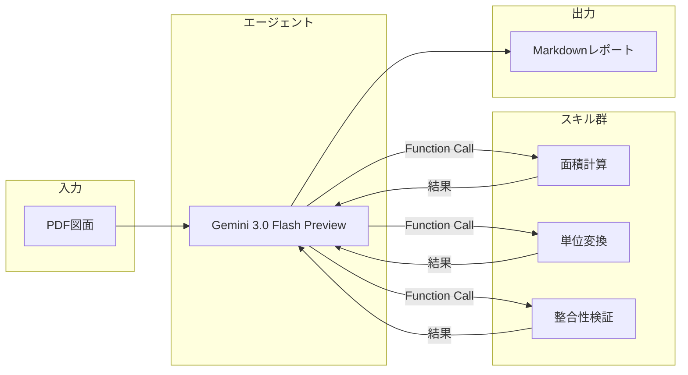

# Plan2Table

建築図面（PDF）から部屋情報を自動抽出し、美しいMarkdownレポートを生成するWebアプリケーションです。Google Cloud Vertex AI（Gemini 3.0 Flash Preview）と **Function Calling** を活用した「エージェント方式」により、高精度な数値抽出と検証を実現しています。

## 特徴

- **ドラッグ&ドロップでPDFをアップロード**: 平面詳細図や仕上表を含む図面に対応
- **AIによる自動抽出**: 室名、帖数、面積、床・壁・天井仕上げ、備考などを一括抽出
- **エージェントスキルによる検証**: AIが自律的にツールを呼び出し、計算・単位変換・整合性チェックを実行
- **Markdownレポート出力**: プロフェッショナルな外観のレポートを即座に生成

## アーキテクチャ

本アプリケーションは、従来の「一発でAIに回答を求める」方式ではなく、**AIが自律的にツールを呼び出して検証・計算する「エージェント方式」** を採用しています。



### 処理の流れ

1. **PDF読み込み**: ユーザーがアップロードした図面PDFをバイナリとして取得
2. **テキスト抽出**: pdfplumberで補助的にテキストを抽出（正規表現によるフォールバック用）
3. **AIへ送信**: PDFバイナリとプロンプトをGemini 3.0 Flash Previewに送信
4. **Function Calling**: AIが必要に応じてスキル（計算・変換・検証）を呼び出し
5. **スキル実行**: Python関数で正確な計算を実行し、結果をAIに返却
6. **レポート生成**: AIが検証済みの数値を使ってMarkdownレポートを生成
7. **HTML変換**: MarkdownをHTMLに変換し、スタイル付きで表示

## 利用可能なスキル

AIエージェントは以下のスキルを自律的に呼び出すことができます：

| スキル名 | 説明 | 入力例 | 出力例 |
|---------|------|--------|--------|
| `calculate_area` | 幅×高さから面積を計算 | `width=3.9, height=5.1` | `19.89` |
| `convert_tsubo_to_m2` | 坪からm²へ変換 | `tsubo=12.58` | `41.59` |
| `calculate_tatami_area_m2` | 帖数からm²へ変換 | `tatami=6.0` | `9.92` |
| `validate_area_sum` | 合計面積の整合性を検証 | `room_areas=[19.89, 11.48], expected_total=31.37` | `{diff: 0.0, is_valid: true}` |

これにより、AIの「頭の中の計算」ではなく、実際のPython関数による正確な計算・検証が行われます。

## ファイル構成

```
plan2table/
├── main.py                     # FastAPIアプリケーション本体
├── extractors/
│   ├── __init__.py
│   ├── area_regex.py           # 正規表現による面積抽出（フォールバック）
│   ├── text_extractor.py       # PDFからのテキスト抽出
│   ├── skills.py               # スキル関数の実装
│   └── tool_definitions.py     # Function Calling用のツール定義
├── prompts/
│   └── area_extract.md         # AIへのプロンプト
├── templates/
│   └── index.html              # フロントエンドUI
├── Dockerfile
├── Makefile
├── requirements.txt
└── README.md
```

## セットアップ

### 環境変数

以下の環境変数を設定してください：

| 変数名 | 必須 | 説明 |
|--------|------|------|
| `GOOGLE_CLOUD_PROJECT` | ✅ | Google CloudプロジェクトID |
| `GCP_SERVICE_ACCOUNT_KEY` | ✅ | サービスアカウントJSONキーの**内容全体** |
| `VERTEX_LOCATION` | - | Vertex AIのロケーション（デフォルト: `global`） |
| `VERTEX_MODEL_NAME` | - | 使用するモデル名（デフォルト: `gemini-3-flash-preview`） |

### ローカル開発（Docker + 1Password）

本プロジェクトでは、1Password CLIを使って認証情報を安全に管理しています：

```bash
# 1Password CLIでシークレットが取得できることを確認
make check

# Dockerイメージをビルドして起動
make run

# ロケーションやモデルを変更する場合
make run VERTEX_LOCATION=us-central1 VERTEX_MODEL_NAME=gemini-2.0-flash
```

ブラウザで http://localhost:7860 にアクセスしてください。

### Hugging Face Spacesへのデプロイ

1. SpaceのSettingsで`GOOGLE_CLOUD_PROJECT`と`GCP_SERVICE_ACCOUNT_KEY`を設定
2. Dockerfileが自動的にビルド・デプロイされます

## 技術スタック

- **Backend**: FastAPI + Uvicorn
- **AI**: Google Cloud Vertex AI (Gemini 3.0 Flash Preview)
- **SDK**: google-genai (新SDK)
- **PDF処理**: pdfplumber
- **Frontend**: HTML + Tailwind CSS + htmx
- **Infrastructure**: Docker

## ライセンス

MIT License
