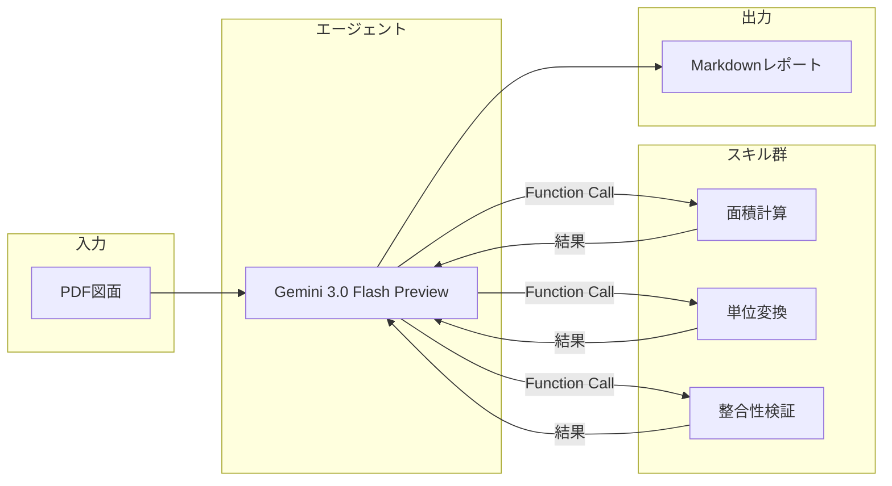

# Plan2Table

> 📐 **建築図面を「読む」から「使えるデータ」に変えるAIエージェント（Domain-Specific Agent）**

建築図面（PDF）から部屋情報を自動抽出し、美しいMarkdownレポートを生成するWebアプリケーションです。  
Google Cloud Vertex AI（Gemini 3.0 Flash Preview）と **Function Calling**[^1] を活用した「エージェント方式」により、高精度な数値抽出と検証を実現しています。

## 特徴

- **ドラッグ&ドロップでPDFをアップロード**: 平面詳細図や仕上表を含む図面に対応
- **AIによる自動抽出**: 室名、帖数、面積、床・壁・天井仕上げ、備考などを一括抽出
- **エージェントスキルによる検証**: AIが自律的にツールを呼び出し、計算・単位変換・整合性チェックを実行
- **Markdownレポート出力**: プロフェッショナルな外観のレポートを即座に生成

## アーキテクチャ

本アプリケーションは、従来の「一発でAIに回答を求める」方式ではなく、**AIが自律的にツールを呼び出して検証・計算する「エージェント方式」** を採用しています。

以下は、Plan2Table における「論理的な処理フロー」を示した図です。
基盤モデル（エージェント）とスキル群の役割分担に焦点を当てています。



> ℹ️ **実行環境について**  
> 図中の「エージェント（Gemini）」は Google Cloud Vertex AI 上で実行されており、「スキル群（面積計算・単位変換・整合性検証）」は、本アプリケーションとしてデプロイされた **Python関数** が実行主体です。エージェントはスキルを直接実行することはなく、**必要な処理を判断し、呼び出しを指示する役割**を担っています。

### 処理の流れ


1. **データの入力と送信**:
   ユーザーがアップロードした図面PDFをバイナリ形式のまま、指示書（プロンプト）と共に Gemini 3.0 Flash Preview へ直接送信します。

2. **マルチモーダル図面解析**:
   AIがPDFのレイアウトや図面（線や記号）を「視覚的」に直接読み取り、室名や面積などの情報を抽出します。

3. **スキルの自律実行 (Function Calling)**:
   AIが自身の判断で、計算や単位変換などの「スキル（Python関数）」を呼び出し、抽出した数値の正確性を精密に検証します。

4. **構造化レポートの生成**:
   検証済みの正しい数値に基づき、AIがMarkdown形式のレポートを生成します。

5. **HTMLレンダリングと表示**:
   Markdownを即座にHTMLへ変換して画面上に表示します。

---

> **※ 補助プロセス（デバッグ・検証用）**
> 上記のメインフローとは別に、内部では `pdfplumber` を用いてテキスト抽出を行い、正規表現による面積の取得も並行して実施しています。これは主に開発者向けのデバッグ情報や、AIの回答を検証する補助データとして活用されています。

## 利用可能なスキル

AIエージェントは以下のスキルを自律的に呼び出すことができます：

| スキル名 | 説明 | 入力例 | 出力例 |
|---------|------|--------|--------|
| `calculate_area` | 幅×高さから面積を計算 | `width=3.9, height=5.1` | `19.89` |
| `convert_tsubo_to_m2` | 坪からm²へ変換 | `tsubo=12.58` | `41.59` |
| `calculate_tatami_area_m2` | 帖数からm²へ変換 | `tatami=6.0` | `9.92` |
| `validate_area_sum` | 合計面積の整合性を検証 | `room_areas=[19.89, 11.48], expected_total=31.37` | `{diff: 0.0, is_valid: true}` |

これにより、AIの「頭の中の計算」ではなく、実際のPython関数による正確な計算・検証が行われます。その結果、**基盤モデルの推論誤差を許容せず、数値だけは必ず機械的に正しくする**という設計を実現しています。

## ファイル構成

```
plan2table/
├── main.py                     # FastAPIアプリケーション本体
├── extractors/
│   ├── __init__.py
│   ├── area_regex.py           # 正規表現による面積抽出（フォールバック）
│   ├── text_extractor.py       # PDFからのテキスト抽出
│   ├── skills.py               # スキル関数の実装
│   └── tool_definitions.py     # Function Calling用のツール定義
├── prompts/
│   └── area_extract.md         # AIへのプロンプト
├── templates/
│   └── index.html              # フロントエンドUI
├── Dockerfile
├── Makefile
├── requirements.txt
└── README.md
```

## セットアップ

### 環境変数

以下の環境変数を設定してください：

| 変数名 | 必須 | 説明 |
|--------|------|------|
| `GOOGLE_CLOUD_PROJECT` | ✅ | Google CloudプロジェクトID |
| `GCP_SERVICE_ACCOUNT_KEY` | ✅ | サービスアカウントJSONキーの**内容全体** |
| `VERTEX_LOCATION` | - | Vertex AIのロケーション（デフォルト: `global`） |
| `VERTEX_MODEL_NAME` | - | 使用するモデル名（デフォルト: `gemini-3-flash-preview`） |

### ローカル開発（Docker + 1Password）

本プロジェクトでは、1Password CLIを使って認証情報を安全に管理しています：

```bash
# 1Password CLIでシークレットが取得できることを確認
make check

# Dockerイメージをビルドして起動
make run

# ロケーションやモデルを変更する場合
make run VERTEX_LOCATION=us-central1 VERTEX_MODEL_NAME=gemini-2.0-flash
```

ブラウザで http://localhost:7860 にアクセスしてください。

### Hugging Face Spacesへのデプロイ

1. SpaceのSettingsで`GOOGLE_CLOUD_PROJECT`と`GCP_SERVICE_ACCOUNT_KEY`を設定
2. Dockerfileが自動的にビルド・デプロイされます

## 技術スタック

- **Backend**: FastAPI + Uvicorn
- **AI**: Google Cloud Vertex AI (Gemini 3.0 Flash Preview)
- **SDK**: google-genai
- **PDF処理**: pdfplumber
- **Frontend**: HTML + Tailwind CSS + htmx
- **Infrastructure**: Docker

## 入力例１（建築図面PDF）

以下は、本アプリに入力した建築図面PDFの一部です。

[](https://gyazo.com/8d510836fe35d70b2066b9478e16977a)

## 出力例１

<details>
<summary><strong>📄 アプリ出力例：建築図面解析レポート（Aタイプ平面詳細図）</strong></summary>

<br>

> ℹ️ **このセクションはアプリの自動生成出力例です**  
> PDFの建築図面を入力として、図面情報・面積計算・内装仕上表を構造化して出力しています。

---

# 建築図面解析レポート：Aタイプ平面詳細図

## 1. 図面の概要

本図面は「Aタイプ」の住戸に関する**平面詳細図**であり、各室のレイアウト、寸法、および内装仕上情報が網羅されています。

- **図面名称**：平面詳細図  
- **図面番号**：DA-01  
- **住戸タイプ**：Aタイプ  
- **主要構成**：  
  LDK、洋室、キッチン、洗面室、便所、浴室、ウォークインクローゼット（WIC）、バルコニー  

---

## 2. 面積情報

図面に記載された計算式に基づき、以下の面積が算出されています。

### 住戸専用面積

**計算式**

- 3.90m × 5.10m = 19.89㎡  
- 4.85m × 4.50m = 21.82㎡  

**合計**：  
**41.71㎡（約12.58坪）**

---

### バルコニー面積

**計算式**

- 1.40m × 4.50m = 6.30㎡  

**合計**：  
**6.30㎡（約1.9坪）**

---

### 部屋面積（主要居室合計）

**計算式**

- 19.89㎡ + 1.15㎡ = 21.04㎡  

**合計**：  
**21.04㎡（約12.95帖）**

---

## 3. 各室の仕上・詳細

| 室名 | 面積 / 帖数 | 床 | 巾木 | 壁 | 天井 | 備考 |
|---|---|---|---|---|---|---|
| LDK | 11.48㎡（7.0帖） | フローリング W=101 | 木製（オレフィン） | ビニールクロス | ビニールクロス | カーテンボックス、カーテンレール（W）、エアコン（壁掛け） |
| 洋室 | 9.55㎡（5.7帖） | フローリング W=101 | 木製（オレフィン） | ビニールクロス | ビニールクロス | カーテンボックス、カーテンレール（W） |
| 玄関 | - | 石貼り（規格品） | 石製 | ビニールクロス | ビニールクロス | 上框：石製、下足入れ |
| 廊下 | - | フローリング W=101 | 木製（オレフィン） | ビニールクロス | ビニールクロス | - |
| キッチン | - | 塩ビ複合床材* | 木製（オレフィン） | ビニールクロス / タイル・パネル貼 | ビニールクロス | ミニキッチン（*LD一体時はフローリング） |
| 洗面室 | - | 塩ビ複合床材 | ソフト巾木 | ビニールクロス | ビニールクロス | 洗面化粧台、物入、洗濯機パン（640×640） |
| 便所 | - | 塩ビ複合床材 | ソフト巾木 | ビニールクロス | ビニールクロス | シャワートイレ、ペーパーホルダー、タオル掛、吊戸棚 |
| WIC | - | フローリング W=101 | 木製（オレフィン） | ビニールクロス | ビニールクロス | ウォークインクローゼット |
| 浴室 | 1216サイズ | - | - | - | - | - |

---

## 4. まとめ・注釈

- **遮音性能**  
  隣戸との間仕切壁には、  
  **PB（12.5mm）＋遮音シート＋グラスウール充填**  
  の遮音間仕切が採用されています。

- **断熱性能**  
  天井スラブおよび壁面には、**奥行450mmの範囲**で  
  **断熱ボード（ア10）の折り返し施工**が指定されています。

- **設備**  
  LDKおよび洋室には、**エアコン実装またはスリーブ**が設置されており、  
  機能的な居住空間が確保されています。

- **バリアフリー配慮**  
  出入り可能窓の立ち上がり寸法（**FL+90、FL+505**）など、  
  開口部の詳細も明記されています。

</details>


## 入力例２（建築図面PDF）

以下は、本アプリに入力した建築図面PDFの一部です。

[](https://gyazo.com/4f51ab2992cc6df86bf722803f8b7af8)

<details>
<summary><strong>間取り図サンプル A-1（クリックで展開）</strong></summary>

<br>

> ℹ️ **このセクションはアプリの自動生成出力例です**  
> PDFの建築図面を入力として、図面情報・面積計算・内装仕上表を構造化して出力しています。

---

## 物件間取り解析レポート：間取り図サンプル A-1

本レポートでは、提供された「間取り図サンプル A-1」に基づき、物件の構成、面積、および各室の詳細について解析した結果を報告します。

---

## 1. 図面の概要

- **図面名称**: 間取り図サンプル A-1  
- **物件タイプ**: 2階建て戸建住宅（2LDK + ビルトインガレージ）  
- **主要採光面**: 南東向き（バルコニー側）

### 基本構成
- **1階**：洋室、水回り（浴室・洗面）、玄関、ビルトインガレージ  
- **2階**：LDK、洋室、トイレ、バルコニー  

---

## 2. 面積情報

図面に記載された帖数に基づき、主要な居室の面積を算出しました（**1帖＝1.62㎡**で換算）。

- **主要居室面積合計**: **46.00㎡（約13.90坪）**

| 室名 | 帖数 | 面積（㎡） |
|---|---:|---:|
| 1階 洋室 | 7.2帖 | 11.66 |
| 2階 LDK | 14.5帖 | 23.49 |
| 2階 洋室 | 6.7帖 | 10.85 |

- **推定延床面積**: 約 **90.00㎡（約27.19坪）**  
  ※ガレージ、階段、廊下、水回り、収納等の面積を含む概算値  
- **推定バルコニー面積**: 約 **3.24㎡（約0.98坪）**  
  ※LDKの幅に合わせた一般的な奥行き（0.9m）として算出  

---

## 3. 各室の仕上・詳細

### 1階（1F）

| 室名 | 帖数 | 面積（㎡） | 備考 |
|---|---:|---:|---|
| 洋室 | 7.2帖 | 11.66 | クローゼット（CL）併設、南側に窓あり |
| 浴室 | - | - | 1坪タイプ程度の広さを確保 |
| 洗面室 | - | - | 洗面化粧台、洗濯機置場あり |
| 玄関 | - | - | 下足入れスペースあり |
| ガレージ | - | - | ビルトインタイプ、建物内部からアクセス可能 |
| 収納・物入 | - | - | 階段下収納および廊下収納あり |

---

### 2階（2F）

| 室名 | 帖数 | 面積（㎡） | 備考 |
|---|---:|---:|---|
| LDK | 14.5帖 | 23.49 | 対面式キッチン、バルコニーに面する |
| 洋室 | 6.7帖 | 10.85 | クローゼット（CL）2箇所あり |
| トイレ | - | - | 独立した個室、手洗い場あり |
| 廊下 | - | - | 階段から各室への動線 |
| バルコニー | - | - | LDK南側に配置 |

---

## 4. まとめ・注釈

- **空間の有効活用**  
  1階にビルトインガレージを配置し、2階に広々としたLDK（14.5帖）を設けることで、プライバシーを確保しつつ開放的な居住空間を実現しています。

- **収納の充実**  
  各居室のクローゼットに加え、階段下や廊下、玄関付近にも収納が配置されており、生活動線に配慮された設計です。

- **採光と通風**  
  2階LDKは南側のバルコニーに面しており、良好な採光が期待できます。また、各居室に2面以上の開口部が検討されており、通風にも配慮されています。

---

※本レポートの面積値は図面上の帖数からの換算値であり、実際の施工面積や登記面積とは異なる場合があります。

</details>

[^1]: ここでいう Function Calling は、視覚・言語・構造理解を統合した基盤モデル（Foundation Model）が、推論の一部をアプリケーション側の関数に委譲するための仕組みです。Plan2Table では、基盤モデルに判断を任せつつ、数値計算や検証といった決定的処理はコード側で実行することで、**再現性と信頼性を優先したシステム設計**を採用しています。


