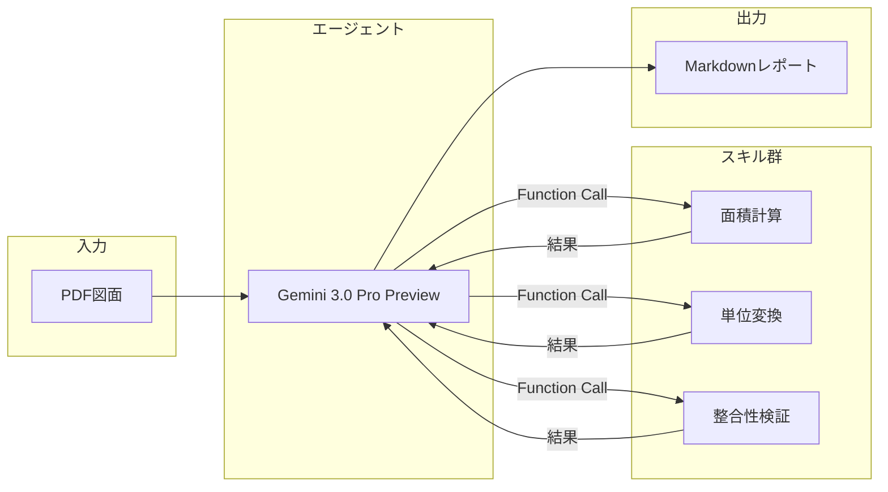

# Plan2Table

> 📐 **建築図面を「読む」から「使えるデータ」に変えるAIエージェント（Domain-Specific Agent）**

建築図面（PDF）から部屋情報を自動抽出し、美しいMarkdownレポートを生成するWebアプリケーションです。  
Google Cloud Vertex AI（Gemini 3.0 Pro Preview）と **Function Calling**[^1] を活用した「エージェント方式」により、高精度な数値抽出と検証を実現しています。  
**図面タイプ自動判断機能**により、寸法線がある詳細図面と面積が記載されている簡易図面の両方に対応しています。

## 特徴

- **ドラッグ&ドロップでPDFをアップロード**: 平面詳細図や仕上表を含む図面に対応
- **図面タイプ自動判断**: 寸法線がある詳細図面（`detailed`）と面積が記載されている簡易図面（`simple`）を自動判別し、適切な処理を実行
- **AIによる自動抽出**: 室名、帖数、面積、床・壁・天井仕上げ、備考などを一括抽出
- **エージェントスキルによる検証**: AIが自律的にツールを呼び出し、計算・単位変換・整合性チェックを実行
- **柔軟な検証ロジック**: 固定の必須部屋リストに依存せず、図面から読み取れる情報に基づいて柔軟に検証
- **Markdownレポート出力**: プロフェッショナルな外観のレポートを即座に生成

## アーキテクチャ

本アプリケーションは、従来の「一発でAIに回答を求める」方式ではなく、**AIが自律的にツールを呼び出して検証・計算する「エージェント方式」** を採用しています。

以下は、Plan2Table における「論理的な処理フロー」を示した図です。
基盤モデル（エージェント）とスキル群の役割分担に焦点を当てています。



> ℹ️ **実行環境について**  
> 図中の「エージェント（Gemini）」は Google Cloud Vertex AI 上で実行されており、「スキル群（面積計算・単位変換・整合性検証）」は、本アプリケーションとしてデプロイされた **Python関数** が実行主体です。エージェントはスキルを直接実行することはなく、**必要な処理を判断し、呼び出しを指示する役割**を担っています。

## ワークフロー


1. **Ingest: データの入力と送信**
   図面PDFをバイナリ形式のまま、**Gemini 3.0 Pro Preview** へダイレクトにストリーム。プロンプトと共にコンテキストを保持した状態で処理を開始します。

2. **Analyze: マルチモーダル図面解析とタイプ判断**
   LLMによる視覚的解析を実行。図面内の線画・記号・レイアウトを直接読み取り、室名や面積などの情報を**空間的に認識**して抽出します。  
   同時に、図面タイプ（`detailed`/`simple`）を自動判断し、適切な処理方法を選択します。

3. **Validate: スキルの自律実行 (Function Calling)**
   抽出された数値を**Python関数**へ渡し、計算整合性や単位変換を自律的に検証。AIの判断とプログラムの正確性を組み合わせて精度を担保します。  
   **`detailed`図面の場合**: 寸法線を読み取って面積を計算。**`simple`図面の場合**: 記載されている面積をそのまま抽出。

4. **Export: 構造化レポートの生成**
   検証をパスしたクリーンなデータに基づき、再利用性の高い**Markdown形式**のレポートを動的に生成します。

5. **Render: HTMLレンダリングと表示**
   生成されたMarkdownを即座に**HTMLへパース**。ユーザーインターフェース上で、リッチなプレビューとしてシームレスに表示します。

---

> [!NOTE]
> 開発・デバッグ用途として、`pdfplumber` を用いたテキスト解析（正規表現）も並行して実施しています。抽出結果はブラウザの開発者コンソールに出力され、AIの出力と比較確認できます。


## 利用可能なスキル

AIエージェントは以下のスキルを自律的に呼び出すことができます：

| スキル名 | 説明 | 入力例 | 出力例 |
|---------|------|--------|--------|
| `calculate_area` | 幅×高さから面積を計算 | `width=3.9, height=5.1` | `19.89` |
| `convert_tsubo_to_m2` | 坪からm²へ変換 | `tsubo=12.58` | `41.59` |
| `calculate_tatami_area_m2` | 帖数からm²へ変換 | `tatami=6.0` | `9.92` |
| `validate_area_sum` | 合計面積の整合性を検証 | `room_areas=[19.89, 11.48], expected_total=31.37` | `{diff: 0.0, is_valid: true}` |
| `calculate_room_area_from_dimensions` | 寸法（mm）から部屋の面積と帖数を計算 | `room_name="玄関", width_mm=1200, depth_mm=1400` | `{area_m2: 1.68, tatami: 1.0, calculation: "1.2m × 1.4m = 1.68㎡"}` |
| `calculate_composite_area` | 複数の矩形領域を加算・減算して面積を計算 | `room_name="LDK", areas=[{width_mm: 3900, depth_mm: 5100, operation: "add"}]` | `{area_m2: 19.89, tatami: 12.3, steps: [...]}` |

これにより、AIの「頭の中の計算」ではなく、実際のPython関数による正確な計算・検証が行われます。その結果、**基盤モデルの推論誤差を許容せず、数値だけは必ず機械的に正しくする**という設計を実現しています。

### 図面タイプ自動判断

本アプリケーションは、入力された図面を以下の2タイプに自動分類し、適切な処理を行います：

- **`detailed`（詳細図面）**: 寸法線（mm単位）があり、面積を計算できる図面
  - 平面詳細図、施工図など
  - 寸法線を読み取って`calculate_room_area_from_dimensions`で面積を計算
  - 仕上表に記載されている全ての室について、必ず面積を算出
  
- **`simple`（簡易図面）**: 面積が文字で直接記載されており、寸法線がない図面
  - 間取り図、パンフレットなど
  - 記載されている面積をそのまま抽出
  - 記載がない場合は空欄でも可

この判断により、様々なタイプの図面に柔軟に対応できます。

## ファイル構成

```
plan2table/
├── main.py                     # FastAPIアプリケーション本体
├── extractors/
│   ├── __init__.py
│   ├── area_regex.py           # 正規表現による面積抽出（デバッグ用）
│   ├── text_extractor.py       # PDFからのテキスト抽出
│   ├── skills.py               # スキル関数の実装
│   └── tool_definitions.py     # Function Calling用のツール定義
├── prompts/
│   ├── __init__.py             # プロンプト読み込みユーティリティ
│   └── area_extract.md         # AIへのプロンプト
├── templates/
│   ├── index.html              # ポータルUI
│   ├── me-check.html           # お客さん向けUI
│   ├── develop.html            # 開発者向けUI
│   └── area.html               # LLM解析UI
├── tests/
│   ├── test_area_regex.py      # 正規表現抽出のテスト
│   └── test_prompt_load.py     # プロンプト読み込みのテスト
├── .github/
│   └── workflows/
│       └── sync-to-hf-spaces.yml  # Hugging Face Spaces自動同期
├── Dockerfile
├── Makefile
├── requirements.txt
└── README.md
```


## 技術スタック

- **Backend**: FastAPI + Uvicorn
- **AI**: Google Cloud Vertex AI (Gemini 3.0 Pro Preview)
- **SDK**: google-genai
- **PDF処理**: pdfplumber
- **Frontend**: HTML + Tailwind CSS + htmx
- **Infrastructure**: Docker

## 開発環境のセットアップ

**テスト・リント・フォーマットはすべて Docker 上で実行します。** ローカルに Python を入れなくても、Docker さえあれば `make test` / `make lint` / `make format` が使えます。CI も同じ Docker イメージで動かします。

### 必要なもの

- **Docker**（`make build` / `make run` / `make test` / `make lint` / `make format` に必要）

### 開発でよく使うコマンド（すべて Docker 内）

```bash
make build          # イメージをビルド（初回や Dockerfile/requirements 変更後）
make test           # テスト実行
make lint           # ruff でリント
make format         # black でフォーマット
make format-check   # フォーマットチェックのみ（CI 用）
make check-all      # lint + format-check をまとめて実行
make run            # アプリ起動（1Password で GCP 認証が必要）
```

初回は `make build` を実行してから `make test` などを使います。以降はソースを変更しただけなら再ビルド不要で、そのまま `make test` でカレントのコードがコンテナにマウントされて実行されます。

### ローカルで Python を使う場合（任意）

IDE の補完やデバッグ、`uvicorn main:app --reload` で手元だけ動かしたい場合は、**Python 3.14** の venv を用意してください。

- 本プロジェクトは **Python 3.14** を要求します（`pyproject.toml` の `requires-python`）。
- **macOS** では、Xcode Command Line Tools の `python3` は LibreSSL のため非推奨。**Homebrew**（`brew install python@3.14`）や **python.org**・**pyenv**（`.python-version` に `3.14`）で OpenSSL 付きの Python 3.14 を入れてから venv を作成してください。

```bash
python3.14 -m venv .venv && source .venv/bin/activate
pip install --upgrade pip && pip install -r requirements-dev.txt
```

- `.venv` はプロジェクト専用です。`AGENTS.md` の 1Password ワークフローで GCP 認証する際も、venv を有効化したまま `make run` 等を実行して問題ありません。
- 本番・CI の test/lint/format は **Docker 上の同じイメージ**で実行されます。

## 入力例１（建築図面PDF）

以下は、本アプリに入力した建築図面PDFの一部です。

[](https://gyazo.com/8d510836fe35d70b2066b9478e16977a)

## 出力例１

<details>
<summary><strong>📄 アプリ出力例：建築図面解析レポート（Aタイプ平面詳細図）</strong></summary>

<br>

> ℹ️ **このセクションはアプリの自動生成出力例です**  
> PDFの建築図面を入力として、図面情報・面積計算・内装仕上表を構造化して出力しています。

---

# 図面解析レポート

## 1. 図面の概要

- **図面名称**: 平面詳細図  
- **図面番号**: DA-01  
- **作成年月日**: 未記載  
- **縮尺**: 未記載  
- **タイプ**: Aタイプ  

---

## 2. 面積情報

- **住戸専用面積**: 41.71㎡（約12.58坪）  
  - 計算式: 3.90m × 5.10m = 19.89㎡、4.85m × 4.50m = 21.82㎡  
- **バルコニー面積**: 6.30㎡（約1.9坪）  
  - 計算式: 1.40m × 4.50m = 6.30㎡  
- **部屋面積合計 (LDK+洋室)**: 21.04㎡（12.95帖）  
  - 計算式: 3.90m × 5.10m = 19.89㎡、1.10m × 1.05m = 1.15㎡  

---

## 3. 各室の仕上・詳細

※ LDKおよび洋室の面積・帖数は図面記載値を採用しています。その他の室は図面の寸法線から推測して算出しています。  

| 室名 | 帖数 | 面積 | 床 | 巾木 | 壁 | 天井 | 備考 |
| --- | --- | --- | --- | --- | --- | --- | --- |
| 玄関 | 1.3帖 | 2.05㎡ | 石製り(規格品) | 石製 | ビニールクロス | ビニールクロス | 上框:石製、下足入れ |
| 廊下 | 1.0帖 | 1.65㎡ | フローリング W=101 | 木製(オレフィンシート貼) | ビニールクロス | ビニールクロス | - |
| LDK | 7.0帖 | 11.48㎡ | フローリング W=101 | 木製(オレフィンシート貼) | ビニールクロス | ビニールクロス | カーテンボックス、カーテンレール(W)、エアコン(壁掛け) |
| 洋室 | 5.7帖 | 9.55㎡ | フローリング W=101 | 木製(オレフィンシート貼) | ビニールクロス | ビニールクロス | カーテンボックス、カーテンレール(W) |
| ウォークインクローゼット | 1.0帖 | 1.56㎡ | フローリング W=101 | 木製(オレフィンシート貼) | ビニールクロス | ビニールクロス | - |
| K | 2.4帖 | 3.86㎡ | 塩ビ複合床材 (一体タイプはフローリング W=101) | 木製(オレフィンシート貼) | ビニールクロス、(流し前)キッチンパネル貼 または 100～200角タイル貼り | ビニールクロス | ミニキッチン、タオル掛、洗濯機パン |
| 便所 | 0.8帖 | 1.26㎡ | 塩ビ複合床材 | ソフト巾木 | ビニールクロス | ビニールクロス | シャワートイレ、ペーパーホルダー、タオル掛、吊戸棚 |
| 洗面室 | 1.1帖 | 1.76㎡ | 塩ビ複合床材 | ソフト巾木 | ビニールクロス | ビニールクロス | 洗面化粧台、物入、洗濯機パン 640x640 |

---

## 4. まとめ・注釈

- 本図面は「Aタイプ 平面詳細図」であり、各室の詳細な寸法と仕上仕様が記載されています。  
- 遮音間仕切として「PB(12.5)＋遮音シート＋グラスウール充填」が採用されており、防音性に配慮されています。  
- 天井スラブ断熱ボード折返し部分範囲や壁打込み断熱ボードの指定があり、断熱性能を高める設計となっています。  


</details>


## 入力例２（建築図面PDF）

以下は、本アプリに入力した建築図面PDFの一部です。

[](https://gyazo.com/4f51ab2992cc6df86bf722803f8b7af8)

## 出力例２
<details>
<summary><strong>間取り図サンプル A-1（クリックで展開）</strong></summary>

<br>

> ℹ️ **このセクションはアプリの自動生成出力例です**  
> PDFの建築図面を入力として、図面情報・面積計算・内装仕上表を構造化して出力しています。

---
# 建築図面解析レポート

## 1. 図面の概要

- **図面名称**: 間取り図サンプル A-1  
- **階数**: 2階建て  
- **方位**: 北向き（図面右上にNマークあり）  

---

## 2. 面積情報

図面上に住戸専用面積や延床面積の直接的な記載はありません。  
各居室の帖数表記から換算した面積の目安は以下の通りです。  
※換算基準：1帖 = 1.62㎡、1坪 = 3.31㎡として計算  

- **1F 洋室 (7.2帖)**: 約11.66㎡（約3.52坪）  
- **2F 洋室 (6.7帖)**: 約10.85㎡（約3.28坪）  
- **2F LDK (14.5帖)**: 約23.49㎡（約7.10坪）  

---

## 3. 各室の詳細

図面から読み取れる各室の構成は以下の通りです。  
寸法線や仕上表がないため、記載されている帖数と設備配置を抽出しています。  

| 階数 | 室名 | 帖数 | 面積(㎡)換算 | 備考・設備 |
| --- | --- | --- | --- | --- |
| 1F | 洋室 | 7.2帖 | 約11.66㎡ | クローゼット(CL)併設 |
| 1F | 玄関 | - | - | 収納スペースあり |
| 1F | 洗面室 | - | - | 洗面台、洗濯機置き場 |
| 1F | 浴室 | - | - |  |
| 1F | トイレ | - | - |  |
| 1F | 廊下・階段 | - | - | 物入、収納あり |
| 1F | 車庫 | - | - | ビルトインガレージ（駐車スペース1台分） |
| 2F | LDK | 14.5帖 | 約23.49㎡ | システムキッチン、バルコニー隣接 |
| 2F | 洋室 | 6.7帖 | 約10.85㎡ | クローゼット(CL)×2併設 |
| 2F | トイレ | - | - |  |
| 2F | 廊下・階段 | - | - |  |
| 2F | バルコニー | - | - | LDK南側に配置 |

---

## 4. まとめ・注釈

- **間取りタイプ**: 2LDK＋ビルトインガレージ  
- **動線・配置**: 1階にビルトインガレージを設け、水回り（浴室・洗面）を1階に集約しています。2階はLDKを中心とした生活空間となっており、各階にトイレが設置されているため利便性が高い設計です。  
- **収納**: 各洋室にクローゼットが設けられているほか、1階の廊下や玄関周りにも収納・物入が確保されており、収納スペースが充実しています。 

</details>

<br>


[^1]: ここでいう Function Calling は、視覚・言語・構造理解を統合した基盤モデル（Foundation Model）が、推論の一部をアプリケーション側の関数に委譲するための仕組みです。Plan2Table では、基盤モデルに判断を任せつつ、数値計算や検証といった決定的処理はコード側で実行することで、**再現性と信頼性を優先したシステム設計**を採用しています。
